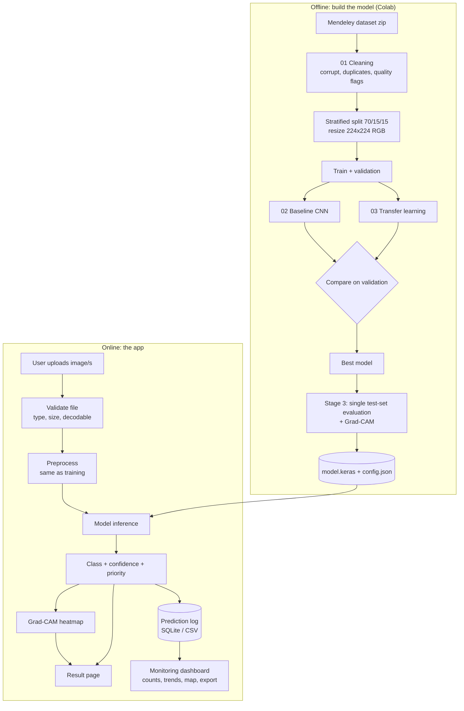
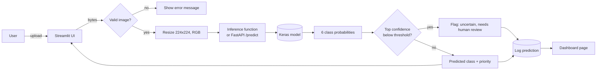

# System Design: UI and Dashboard (Stage 4)

## 1. What the system does
A user uploads a road image (or several). The system cleans it the same way as the training data, runs the CNN, and shows the predicted condition, confidence, a maintenance priority, and an explanation heatmap. Every prediction can be logged so a **monitoring dashboard** can summarize road conditions over time.

## 2. Flowchart

### 2a. Overall system (offline training + online app)


### 2b. What happens on one prediction


## 3. Architecture options (pick one)

| Option | Stack | Effort | Best for |
|---|---|---|---|
| **A (recommended)** | **Streamlit** only. One Python app loads the model and shows the UI. | Low | Course project. Fast, all Python. |
| B | **Gradio** | Lowest | Quick demo (upload box + label output). Less flexible for dashboard pages. |
| C | **FastAPI** backend (`/predict`, `/stats`) + **Streamlit** frontend | Medium | Shows a real backend/frontend split. Good for the "backend" part of your defense. |
| D | Flask/Django + HTML/JS | High | Only if your instructor requires a web framework. |

Recommendation: build **A first**. If time allows, move the inference code behind a FastAPI endpoint (**C**). Because the inference logic lives in `src/`, this is a small change.

## 4. Suggested pages (dashboard)

| Page | Contents |
|---|---|
| **Predict** | Upload image, show class, confidence bar for all 6 classes, Grad-CAM overlay, priority badge |
| **Batch** | Upload many images, table of results, download as CSV |
| **Monitoring** | Counts per class, trend over time, filter by class/date, table of logged predictions, map if images have GPS (EXIF) or the user enters a location |
| **Model performance** | Test accuracy, per-class precision/recall/F1, confusion matrix, learning curves (read from `docs/` files) |
| **Dataset overview** | Class distribution, sample images per class, cleaning summary (ties to the textbook's "Data Visualization" step) |
| **About** | Project objectives, classes, limitations |

### Maintenance priority (team decision, not from the dataset)
Define a simple rule table and state in the paper that it is an assumption:

| Class | Example priority |
|---|---|
| open manhole | Urgent (safety hazard) |
| pothole, water-filled pothole | High |
| damaged asphalt, crack | Medium |
| normal | None |

### Low-confidence handling
If the top probability is below a threshold (e.g. 0.60), show "Uncertain: needs human review" instead of a hard answer. Choose the threshold from validation data, and report it.

## 5. Tools

| Purpose | Tool |
|---|---|
| UI / dashboard | Streamlit (`st.file_uploader`, `st.tabs`, `st.metric`, `st.dataframe`, `st.download_button`) |
| Quick demo alternative | Gradio |
| Backend API | FastAPI + Uvicorn (auto docs at `/docs`) |
| Charts | Plotly Express (interactive) or Altair; matplotlib is fine too |
| Map | `st.map`, or pydeck / folium |
| Storage for logs | SQLite (built into Python) or a CSV file |
| Image handling | Pillow, OpenCV |
| Explainability | Grad-CAM (custom with `tf.GradientTape`, or `tf-keras-vis`) |
| Model loading | `keras.models.load_model("model.keras")` |
| Smaller/faster model (optional) | TensorFlow Lite conversion |
| Deployment (free) | Hugging Face Spaces (Streamlit or Gradio) or Streamlit Community Cloud |
| Containers (optional) | Docker |

## 6. Suggested `app/` layout
```
app/
├── app.py                 Streamlit entry point (Predict page)
├── pages/
│   ├── 1_Batch.py
│   ├── 2_Monitoring.py
│   ├── 3_Model_Performance.py
│   └── 4_Dataset_Overview.py
├── requirements.txt       (app-only dependencies)
└── assets/                Small sample images for the demo (< 1 MB each)
src/
├── config.py              Shared constants
├── preprocess.py          Same preprocessing as Stage 1 (used by the app)
├── inference.py           load_model(), predict(image) -> probabilities
├── gradcam.py             Heatmap function
└── logging_db.py          save_prediction(), load_predictions()
```

## 7. Things that commonly go wrong
1. **Preprocessing mismatch.** The app must resize exactly like Stage 1 (RGB, 224x224, same interpolation and `PAD_TO_SQUARE` setting from `preprocessing_config.json`). Do **not** divide by 255 in the app: the models already rescale inside.
2. **Class order.** Use `class_names` from `preprocessing_config.json`, never a hand-typed list.
3. **Reloading the model on every click.** Load once with `@st.cache_resource`.
4. **Model file not in GitHub.** Our `.gitignore` blocks `*.keras`. For deployment, upload the final model to Hugging Face Hub (or use Git LFS in a separate deploy repo) and download it at app start. Keep the model under ~100 MB.
5. **Heavy dependencies.** `tensorflow` is large. Free hosting can be slow to build. Use `tensorflow-cpu` in the app's `requirements.txt`.
6. **Reporting.** The dashboard's performance page must show **test-set** results, not validation.

## 8. Build order for Stage 4
1. `src/preprocess.py` + `src/inference.py` (test in a notebook first)
2. Streamlit Predict page
3. Confidence handling + priority rule
4. Grad-CAM overlay
5. Prediction logging (SQLite/CSV)
6. Monitoring and Model performance pages
7. Deploy, then test with images that are *not* from the dataset
8. (Optional) FastAPI split

## 9. Who does what
| Person | Task |
|---|---|
| App owner | `app/`, pages, layout |
| Model owner | `inference.py`, `gradcam.py`, export final model |
| Data owner | Dataset overview page, logging schema, monitoring charts |
| Docs owner | Flowcharts, screenshots, user guide, limitations section |
